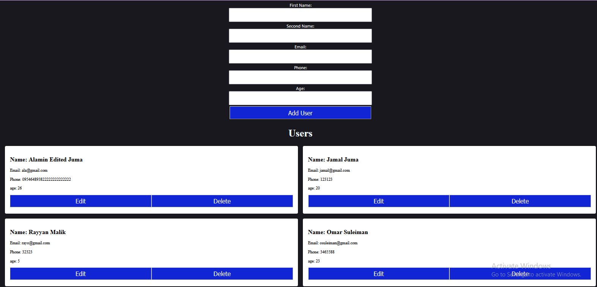

# fullstck-react-django

## using Django framework and react to demonstrate a CRUD app utilizing Reactclient

## adding new users using React forms 

## editing a user with a certain ID

## Routing to the success page displaying confetti on submitting data for adding/editing a user. Then, re-routing back to the home page and fetching the updated data.

